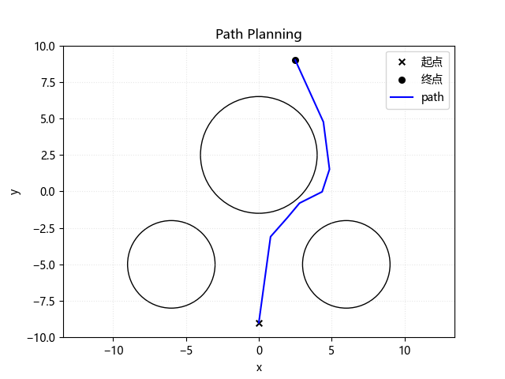

# PyTorch版SAC-Auto强化学习模块

## 零.SAC算法:

###### 自定义程度高的SAC-Auto算法，支持部署策略模型、备份训练过程、多源观测融合、PER等功能

Soft Actor-Critic Algorithms and Applications （arXiv: 1812) # 不是1801版

### 0.SAC_Agent模块

SAC-Auto算法

##### 0.初始化接口

```python
agent = SAC_Agent(env, kwargs=...)      # 初始化算法, 并设置SAC的训练参数
agent.set_buffer(buffer)		        # 为算法自定义replay buffer
agent.set_nn(actor, critic, kwargs=...) # 为算法自定义神经网络
# 更多具体接口信息通过help函数查看DocString
```

##### 1.Torch接口

```python
agent.to('cpu') # 将算法转移到指定设备上
agent.cuda(0)   # 将算法转移到cuda0上运算
agent.cpu()     # 将算法转移到cpu上运算
```

##### 2.IO接口

```python
agent.save('./训练备份')              # 存储算法训练过程checkpoint
agent.load('./训练备份')              # 加载算法训练过程checkpoint
agent.export('策略.onnx', kwargs=...) # 部署训练好的onnx策略模型
```

##### 3.训练交互接口

```python
act_array = agent.select_action(obs, kwargs=...) # 环境交互, 基于策略选择-1~1的随机/确定动作
act_array = agent.random_action()                # 环境随机探索, 完全随机产生-1~1的动作
agent.store_memory(transition, kwargs=...)       # 存储环境转移元组(s, a, r, s_, done)
info_dict = agent.learn(kwargs=...)              # 进行一次SAC优化, 返回Loss/Q函数/...
```

##### 4.其余接口 (在learn方法中调用, 非用户调用)

```python
obs_tensor = agent.state_to_tensor(obs, kwargs) # 将Gym返回的1个obs转换成batch obs, 用于处理混合输入情况, 默认跟随buffer设置
batch_dict = agent.replay_memory(batch_size, kwargs) # 经验回放, 用于实现花样经验回放, 默认跟随buffer设置
agent.buffer_len # 查看当前经验个数, 默认跟随buffer设置
agent.use_per # 查看是否使用PER, 默认跟随buffer设置
```

### 1.SAC_Actor模块和SAC_Critic模块

实现自定义 观测数据Encoder + 策略函数 + Q函数 

要求策略函数的输入为Encoder的输出，Q函数的输入为Encoder输出+动作

##### 0.初始化接口

```python
encoder_net = MyEncoder()                   # 自定义观测编码器
mu_net, logstd_net = MyPolicy(), MyPolicy() # 自定义策略函数
q1_net, q2_net = MyQfun(), MyQfun()         # 自定义双Q函数
actor = SAC_Actor(encoder_net, mu_net, logstd_net, kwargs=...) # 设置自定义actor网络
critic = SAC_Critic(encoder_net, q1_net, q2_net)               # 设置自定义critic网络
```

### 2.BaseBuffer模块

实现自定义经验回放，可自定义存储不同数据类型的混合观测数据（进行一些多传感器数据融合的端到端控制问题求解），也可自定义实现PER等功能。

要求在派生类中实现以下抽象方法（输入参数和返回数据的格式参考DocString)：

| 必须实现的方法       | 功能                                                         |
| -------------------- | ------------------------------------------------------------ |
| reset                | 经验池重置（Off-Policy算法一般用不到），也可用于初始化经验池 |
| push                 | 存入环境转移元组(s, a, r, s_, done)                          |
| sample               | 经验回放产生Batch，返回包含关键字s,a,r,s_,done的字典，每个key对应的value为Tensor或混合形式，PER还要包含关键字IS_Weight |
| state_to_tensor      | 将1个观测数据转换成Batch，返回Tensor或混合形式，主要用于处理混合观测 |
| **非必须实现的方法** | **功能**                                                     |
| save                 | 存储数据，用于保存训练进度，可省略                           |
| load                 | 加载数据，用于保存训练进度，可省略                           |
| update_priorities    | 用于更新PER的优先级，非PER可省略                             |
| is_per               | 是否是PER回放，默认False                                     |
| is_rnn               | 是否RNN按回合回放，默认False                                 |
| nbytes               | 用于查看经验池占用内存，默认0                                |

## 一.SAC应用示例:

### 0.静态路径规划（几何）

直接找几个点组成路径，学习组成路径的点



### 1**.动态路径规划（运动学）**

雷达避障模型


运动学仿真，学习控制量

（先放张效果图，写完论文过完年再更）


## 二.**Requirement**:

python >= 3.9

pytorch >= 1.10.2 （深度学习API）

onnx >= 1.13.1 （模型部署）

onnxruntime >= 1.15.1 （模型推理）

gym >= 0.21.0 （环境API）

shapely >= 2.0.1 （障碍建模）

scipy >= 1.7.3 （积分运算）

numpy >= 1.22.3 （矩阵运算）

matplotlib >= 3.5.1 （可视化）

###### 广告：

[Path-Planning: 路径规划算法，A*、Dijstra、Hybrid A*等经典路径规划](https://github.com/zhaohaojie1998/A-Star-for-Path-Planning)


[Grey-Wolf-Optimizer-for-Path-Planning: 灰狼优化算法路径规划、多智能体/多无人机航迹规划](https://github.com/zhaohaojie1998/Grey-Wolf-Optimizer-for-Path-Planning)


